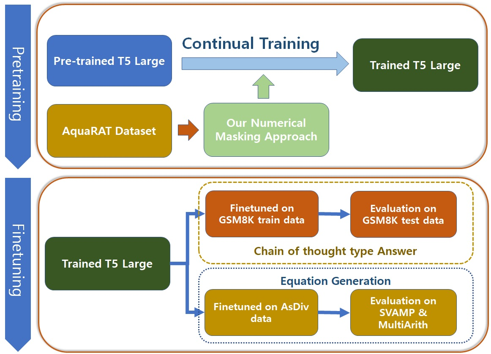
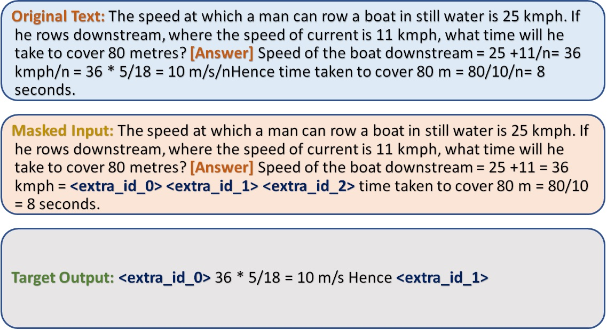
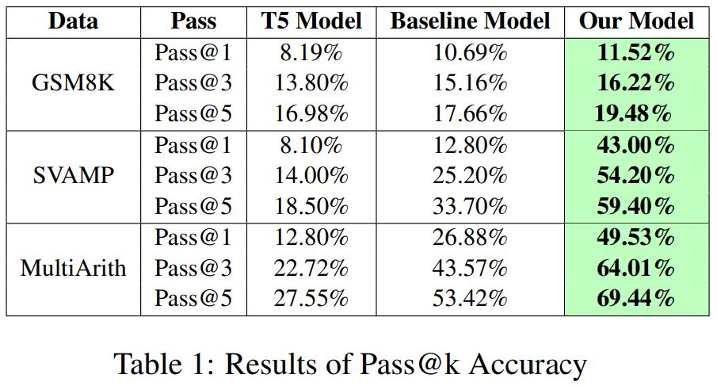

## "Numerical Masking: Enhancing Numerical Proficiency in Language Models for Mathematical Word Problem Solving"
The codes included in this repository were utilized for the research presented at the WiNLP workshop during the EMNLP conference in 2023.

In our work, we introduced a novel masking approach tailored for the Encoder-Decoder architecture, specifically during the pretraining phase on Math Word Problem (MWP) datasets. The application of this approach demonstrated improved outcomes, as evidenced by enhanced evaluations on two distinct dataset types: Chain of Thought (CoT)-based answer datasets and equation generation answer datasets.

# Experiment Outline:

# Proposed Masking Approach:
- Concatenate the input Question, context, and answer segments
- Identify all the indices of the numbers in the answer segment
- Randomly select 50% of the identified indices and mask them with span length 2
- Initially, we chose span length 2, and in other experiments, we have varied masking % and span length to observe the impact.

# An example of the masking:

# Evaluation Results:

## Note: This repository will be updated further to include the results of all variation experiments and Qualitative results. (Last updated 13th Dec 2023)

